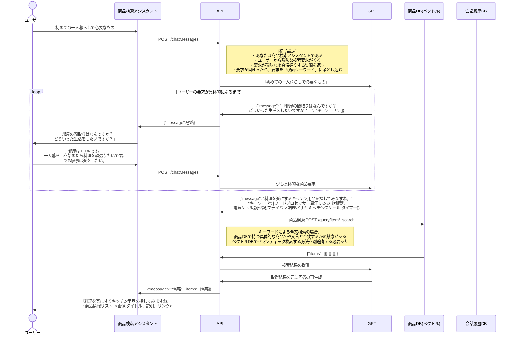

# 商品検索デモの処理フロー設計

## キーワード検索の場合

## ベクトルサーチの場合

上記シーケンスをもとに以下の修正を入れる

- [ ] LlamaIndex を用いたインデック作成部分
- [ ] ES へのクエリをベクトル DB へ変更
  - [ ] LlamaIndex で隠蔽されるが埋め込み API の部分をシーケンスに明記しておく
- [ ] ベクトル DB の情報をもとに、商品情報(画像やリンクなど)を ES に再取得しに行く

